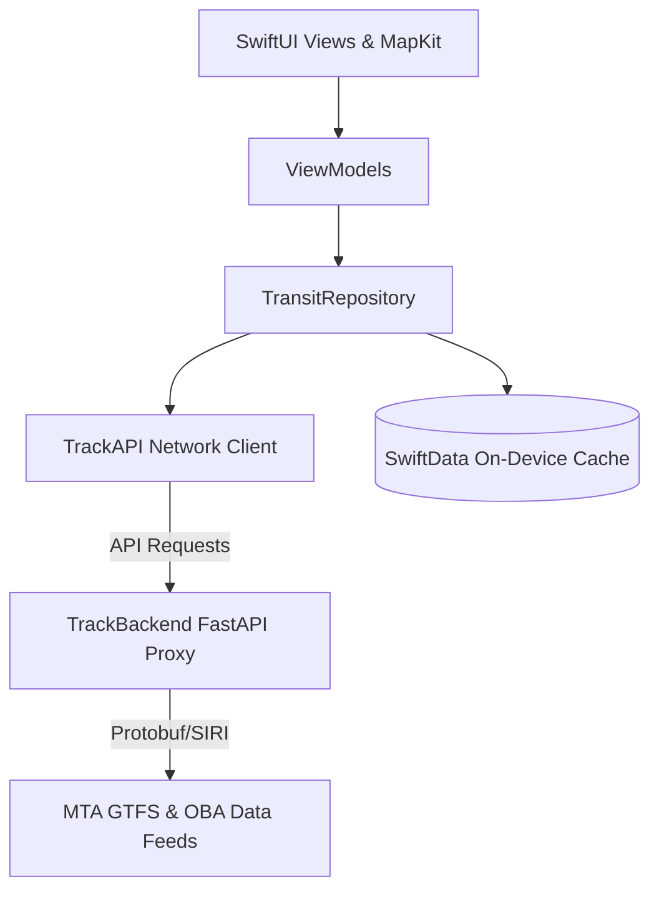

# Track iOS App

**Track** is a high-performance, native iOS application designed for the modern New York City commuter. Built strictly with modern Swift and SwiftUI architectures, Track parses real-time GTFS and SIRI data to deliver live countdowns, live vehicle tracking, and highly contextual alerts directly to your phone, Lock Screen, and Dynamic Island.

This application is powered by the **[Track API Marketplace](./TrackBackend/README.md)**, a custom Python-based proxy that handles heavy lifting, caching, and Protobuf decoding, allowing the iOS client to remain blistering fast.

---

## 🏗 Application Architecture

Track follows strict **MVVM (Model-View-ViewModel)** paradigms bound to a persistent `SwiftData` layer.

### System Diagram



### Core Technologies
- **UI Framework**: SwiftUI (iOS 18+)
- **Mapping Engine**: Apple MapKit natively rendering custom `MapAnnotation` overlays and decoded Google Polylines.
- **Persistence Layer**: SwiftData container shared seamlessly across App Groups.
- **System Extensibility**:
  - **WidgetKit**: Configurable Lock Screen and Home Screen Accessory widgets.
  - **ActivityKit**: Live navigation tracking via the Dynamic Island.
  - **AppIntents**: Exposing native backend triggers directly to Siri.
- **Machine Learning**: On-device CoreML heuristic tracking for analyzing and suggesting commute behaviors.

---

## ✨ Flagship Features

| Feature | Technical Implementation |
| :--- | :--- |
| **Unified "Nearby" Dashboard** | Fetches aggregated Subway, Bus, LIRR, and MNR data endpoints, instantly routing to heavily modularized, swipe-friendly SwiftUI Carousels grouped by route. |
| **Real-Time GPS Mapping** | Tracks active buses via SIRI data. Plots buses dynamically tracking along polylines over Apple Maps using Core Animation for smooth translation. |
| **GO Mode (Hands-Free)** | In-transit navigation state tracking. Removes passed stops, tracks distance remaining via CoreLocation, and projects live ETAs to the Dynamic Island. |
| **Smart Suggestions ML** | Uses on-device predictive modeling tracking prior `TripLog` entries in SwiftData. It learns your daily habits (e.g., checking the L-train on Tuesdays at 9 AM) and surfaces relevant cards automatically. |
| **Pervasive Widgets** | `TimelineProvider` dynamically pings `TrackBackend` schedules, bypassing the app entirely to ensure live counts appear flawlessly beneath your clock. |
| **Live Accessibility** | Constantly polls the MTA elevator-escalator real-time outage feeds, appending "Out of Service" badges explicitly to your saved stations. |

---

## � Source Code Structure

The iOS application avoids massive monolithic single-file implementations in favor of tightly decoupled modules:

```text
Track/
├── TrackApp.swift                 # Entry execution & App Group coordination
├── Models/                        
│   ├── Station.swift              # SwiftData persistable Subway Stations
│   ├── CommutePattern.swift       # Machine Learning statistical heuristics
│   └── BusModels.swift            # Decodable generic schemas bound to FastAPI
├── Views/
│   ├── HomeView.swift             # The primary MapKit / BottomSheet split
│   └── Components/                # Agnostic sub-views (Rows, Cards, Sheets)
├── ViewModels/
│   └── HomeViewModel.swift        # Presentation logic & MapKit region binding
├── Repositories/
│   └── TransitRepository.swift    # State aggregation & Offline-first caching bridge
├── Network/
│   └── TrackAPI.swift             # URLSession endpoint mappers
├── Services/
│   ├── LocationManager.swift      # CoreLocation wrappers
│   └── SmartSuggester.swift       # Processing layer for statistical ML inferences
└── Widgets/
    └── TrackWidget.swift          # Standalone WidgetKit execution targets
```

---

## ⚙️ Development Setup

The `Track` environment requires configuring both the Xcode workspace and the local Python FastAPI proxy.

### 1. Xcode Configuration
1. Open up `Track.xcodeproj` in **Xcode 16+**.
2. Within the **Signing & Capabilities** tab of the project target, assign your personal or team Apple Developer account.
3. Explicitly enable **App Groups**. Ensure the group identifier is identical on both the `Track` and `TrackWidgets` target (e.g. `group.com.yourname.track`).
4. Select an iOS 18+ deployment target and hit **Build (`Cmd+B`)**.

### 2. Networking (Local vs Prod)
By default, the iOS `TrackAPI.swift` points to the production `Render.com` remote instance. 

To bridge directly to your local machine:
1. Fire up the backend locally (see: `TrackBackend/README.md`).
2. Inside the iOS App -> Navigate to **Settings** -> **Developer Tools**.
3. Toggle the **Use Localhost API** target and save changes. The app will instantaneously target `127.0.0.1:8000`.

---

## 🔒 Security & Privacy

This application was engineered strictly avoiding intrusive third-party metrics or telemetry.

1. **Telemetry Restrictions**: Analytics strictly utilize Apple's native opt-in anonymized telemetry channels. No external crash reporting frameworks (Firebase, Crashlytics) are deployed.
2. **On-Device Logging**: Your `CommutePattern` data never touches the cloud. Data is aggregated locally into `SwiftData` SQLite schemas locked beneath standard iOS security partitions.
3. **Data Transit**: All network requests to `TrackBackend` transmit over pure TLS-encrypted `HTTPS`.

---

## 🌐 Next Steps

Looking to explore the exact JSON payloads that power this frontend interface?
👉 **[Read the TrackBackend API Marketplace Documentation](./TrackBackend/README.md)**


__
# TrackBackend

A high-performance Python proxy API for the **Track** iOS app. It ingests raw MTA data (GTFS-Realtime Protobuf and JSON feeds) and serves pristine, standardized JSON to the iOS client.

## Tech Stack

- **Python 3.11+**
- **FastAPI** — Lightning-fast async web framework
- **Pydantic** — Data validation and settings management
- **HTTPX** — Async HTTP client for MTA feeds
- **gtfs-realtime-bindings** — Protobuf decoder for GTFS-Realtime feeds

## Quick Start

```bash
cd TrackBackend
python -m venv .venv
source .venv/bin/activate
pip install -r requirements.txt
uvicorn app.main:app --reload
```

The API will be available at `http://127.0.0.1:8000`. Auto-generated docs are at `/docs`.

## Running Tests

```bash
pip install pytest pytest-asyncio httpx
python -m pytest tests/ -v
```

## 🏪 Track API Marketplace

Welcome to the **Track API Marketplace**, a high-performance Python proxy API powering the Track NYC Transit iOS app.

The API merges highly disparate MTA feeds (GTFS-Realtime Protobuf, GTFS Static JSON/CSV, SIRI, OBA) into unified, pristine JSON schemas ready for mobile clients.

### 🔐 Global Authentication
Currently, no API key is required. However, for future enterprise usage, include:
```http
Authorization: Bearer <YOUR_API_KEY>
```

---

### 🚄 1. Subway Endpoints

#### `GET /subway/shapes/all`
Returns polylines and colors for ALL subway lines. Used to render the full NYC system map.
- **Response `200 OK`**: `{"lines": [{"mode": "subway", "route_id": "L", "name": "L", "color_hex": "A7A9AC", "polylines": ["..."]}]}`

#### `GET /subway/stations/all`
Returns all stations with their coordinates and routes served.
- **Response `200 OK`**: `{"count": 472, "stations": [{"id": "L01", "name": "8 Av", "lat": 40.74, "lon": -74.0, "routes": ["L"]}]}`

#### `GET /subway/stations/nearby`
Returns stations strictly within a GPS radius.
- **Parameters**: `lat` (required), `lon` (required), `radius` (optional)
- **Response `200 OK`**: `{"count": 2, "stations": [...]}`

#### `GET /subway/shape/{route_id}`
Returns the full geometry (polylines) and ordered list of stops for a single subway line.
- **Response `200 OK`**: `{"route_id": "L", "polylines": [...], "stops": [...], "directions": [...]}`

#### `GET /subway/{line_id}`
Live countdown arrivals for a single subway line.
- **Response `200 OK`**: `[{"route_id": "L", "station": "L01", "station_name": "8 Av", "direction": "N", "destination": "8 Av", "minutes_away": 3, "arrival_ts": 1700000000, "status": "On Time"}]`

---

### 🚆 2. Commuter Rail (LIRR & Metro-North)

#### `GET /lirr` | `GET /mnr`
Live countdown arrivals for the Long Island Rail Road or Metro-North.
- **Response `200 OK`**: Array of `TrackArrival` objects matching the subway schema.

#### `GET /lirr/shapes/all` | `GET /mnr/shapes/all`
Polylines and brand colors for all branched routes.
- **Response `200 OK`**: `{"lines": [...]}`

#### `GET /lirr/shape/{route_id}` | `GET /mnr/shape/{route_id}`
Polyline geometry for a specific branch (e.g. `LIRR_9` for Port Washington).

---

### 🚌 3. Bus Endpoints (OBA + SIRI)

#### `GET /bus/routes`
Returns all MTA bus routes.
- **Response `200 OK`**: `[{"id": "MTA NYCT_B63", "short_name": "B63", "long_name": "Atlantic Av", "color": "0039A6"}]`

#### `GET /bus/stops/{route_id}`
Returns all ordered stops for a bus route.
- **Response `200 OK`**: `[{"id": "MTA_308214", "name": "5 Av / Union St", "lat": 40.67, "lon": -73.98, "direction": "0"}]`

#### `GET /bus/live/{stop_id}`
Real-time SIRI bus arrivals at a targeted stop.
- **Response `200 OK`**: `[{"route_id": "...", "vehicle_id": "...", "status_text": "Approaching", "expected_arrival": "2026-...", "distance_meters": 150}]`

#### `GET /bus/vehicles/{route_id}`
Live GPS tracking positions, bearing, and distance for all active buses on a route.
- **Response `200 OK`**: `[{"vehicle_id": "...", "lat": 40.6, "lon": -73.9, "bearing": 180.0, "next_stop": "...", "status_text": "at stop"}]`

#### `GET /bus/route-shape/{route_id}`
Returns encoded polylines to draw the bus path on Apple/Google Maps.

---

### 🌍 4. Nearby Transit (Unified)

#### `GET /nearby/grouped`
The flagship endpoint. Combines **Subway, Bus, LIRR, and MNR** into a single grouped response, sorted by the absolute fastest arriving trains or buses near the user. Returns cleanly formatted JSON designed for multi-tab UI cards.
- **Parameters**: `lat` (required), `lon` (required), `radius` (optional, default 500m), `mode` (optional filter)
- **Response `200 OK`**:
```json
[
  {
    "route_id": "L",
    "display_name": "L",
    "color_hex": "A7A9AC",
    "mode": "subway",
    "directions": [
      {
        "headsign": "8 Av",
        "direction": "N",
        "arrivals": [
          { "minutes_away": 2, "destination": "8 Av", "status": "On Time" }
        ]
      }
    ]
  }
]
```

#### `GET /nearby`
A flattened version of the above, returning purely the nearest raw arrivals.

---

### ⚠️ 5. Status & Alerts

#### `GET /alerts`
Real-time service alerts (delays, planned work) matching the MTA Service Status tracker.
- **Parameters**: `mode` (optional)
- **Response `200 OK`**: `[{"route_id": "L", "title": "Planned Work", "description": "...", "severity": "MODERATE"}]`

#### `GET /accessibility`
Live list of broken elevators and escalators across the system.

---

### 📊 6. Analytics & Intelligence

#### `POST /analytics/log`
Logs an interaction metric when a user tracks a route.
- **Parameters**: `route_id`, `mode`, `interaction_type`

#### `GET /analytics/popular`
Returns the most interacted routes across the entire platform.

---

### 📦 7. Static Data Bundle

#### `GET /static/bundle`
A heavy, highly-cached endpoint hit once by the iOS app to download route shapes, branding, stops, and colors into local CoreData to avoid massive repeated network fetches.

---


## Configuration

All behavior is controlled by `settings.json` in the project root. The iOS app fetches `/config` on launch to receive dynamic settings.

> **Important:** Replace the `mta_api_key` value `"YOUR_KEY_HERE"` in `settings.json` with your actual MTA API key before deploying. Never commit real API keys to source control.

## Directory Structure

```
TrackBackend/
├── app/
│   ├── main.py              # Application entry point
│   ├── config.py            # Settings loader (Pydantic settings)
│   ├── models.py            # Data models (Pydantic schemas)
│   ├── services/
│   │   ├── mta_client.py    # Handles raw MTA calls (Protobuf/XML)
│   │   ├── bus_client.py    # OBA + SIRI bus API client (stops, arrivals, vehicles, shapes)
│   │   └── data_cleaner.py  # Converts raw data to clean JSON
│   └── routers/
│       ├── subway.py        # Endpoints for subway lines
│       ├── bus.py           # Endpoints for bus (routes, stops, live, vehicles, shapes)
│       ├── nearby.py        # Unified nearby transit endpoint
│       ├── lirr.py          # Endpoints for Long Island Rail Road
│       └── status.py        # Endpoints for Alerts/Elevators
├── tests/
│   ├── test_nearby.py       # Tests for /nearby endpoint
│   └── __init__.py
├── settings.json            # THE MASTER CONFIG FILE
├── requirements.txt         # Dependencies
├── Dockerfile               # Container for cloud deployment
└── README.md
```

## GTFS Static Data for Map Lines

The iOS app displays subway, LIRR, and Metro-North route lines on the map. This data comes from the `/static/bundle` endpoint which parses GTFS static files.

### Subway Data
Subway GTFS data is included in the repo at `app/data/subway/` (shapes, stops, etc.).

### LIRR and Metro-North Data
To enable LIRR and Metro-North route lines on the map, download GTFS static data from MTA and place it in these directories:

```
app/data/lirr/gtfslirr/
├── shapes.txt     # Route polyline coordinates
├── trips.txt      # Trip definitions (links routes to shapes)
├── stops.txt      # Station locations
└── routes.txt     # Route definitions

app/data/metro_north/gtfsmnr/
├── shapes.txt
├── trips.txt
├── stops.txt
└── routes.txt
```

**Download GTFS feeds from:** https://new.mta.info/developers

Once the data is in place:
1. Restart the backend server
2. The `/static/bundle` endpoint will include LIRR routes (prefixed `LIRR_*`) and MNR routes (prefixed `MNR_*`)
3. The iOS app will display these routes as dashed lines on the system map

## Data Sources

| Source | Protocol | Usage |
|--------|----------|-------|
| MTA GTFS-Realtime | Protobuf | Subway & LIRR real-time arrivals |
| MTA GTFS Static | CSV | Route shapes for map display |
| MTA SIRI | JSON | Bus arrivals, vehicle positions |
| MTA OBA | JSON | Bus routes, stops, route shapes |
| MTA Alerts | JSON | Service alerts, elevator status |
| Supabase REST | REST | User data, analytics, schedules |
| Supabase Storage | S3 | GTFS static data archives |

## GTFS Data Pipeline

The backend manages MTA's quarterly GTFS static updates automatically. No manual steps required.

### Architecture: Supabase Primary → Docker Fallback

```
┌─────────────────────────────────────────────────────────────────┐
│  STARTUP                                                        │
│                                                                 │
│  1. Download 6 .tar.gz archives from Supabase Storage           │
│     (ETag caching — skips unchanged files)                      │
│  2. If Supabase is down → use Docker-bundled files (fallback)   │
│  3. transit_schedule.db always comes from Docker image           │
└─────────────────────────────────────────────────────────────────┘

┌─────────────────────────────────────────────────────────────────┐
│  BACKGROUND (every 24 hours)                                    │
│                                                                 │
│  1. HEAD requests to MTA GTFS URLs (~0.6s, checks Last-Modified)│
│  2. If MTA published new data:                                  │
│     → Download + extract .zip feeds                             │
│     → Rebuild transit_schedule.db (atomic swap)                 │
│     → Upload changed archives to Supabase                       │
│     → Clear all @lru_cache'd data (zero-downtime refresh)       │
│  3. If no updates → do nothing                                  │
└─────────────────────────────────────────────────────────────────┘
```

### Data Groups in Supabase Storage

| Archive | Contents | Compressed |
|---------|----------|------------|
| `subway_core.tar.gz` | shapes.txt, trips.txt, stops.txt, shape_stops.json | 1.0 MB |
| `subway_routes.tar.gz` | routes.txt | <1 KB |
| `subway_supplemented.tar.gz` | Full supplemented GTFS for iOS bundle | 18 MB |
| `lirr.tar.gz` | LIRR GTFS static feed | 1.8 MB |
| `mnr.tar.gz` | Metro-North GTFS static feed | 1.9 MB |
| `bus_config.tar.gz` | Bus route tag overrides | <1 KB |

> `transit_schedule.db` (863 MB) stays Docker-bundled — too large for Supabase free tier.

### Endpoints

| Method | Path | Description |
|--------|------|-------------|
| GET | `/data/status` | Data group availability + GTFS feed freshness |
| POST | `/data/refresh` | Manually trigger GTFS update check |
| POST | `/data/refresh?full=true` | Check all feeds including bus (slower) |

### Manual GTFS Update (if needed)

```bash
cd TrackBackend

# 1. Download fresh GTFS from MTA
python scripts/download_gtfs.py

# 2. Rebuild the schedule database
python scripts/ingest_gtfs.py

# 3. Upload to Supabase Storage
export SUPABASE_SERVICE_KEY='your-service-role-key'
python scripts/upload_gtfs_to_supabase.py

# 4. Generate iOS static bundle (optional)
python scripts/generate_static_bundle.py
```

### Environment Variables

| Variable | Default | Description |
|----------|---------|-------------|
| `SUPABASE_SERVICE_KEY` | — | Required for Supabase Storage uploads |
| `GTFS_BUCKET` | `gtfs-data` | Supabase Storage bucket name |
| `GTFS_CHECK_INTERVAL` | `86400` (24h) | Seconds between automatic MTA checks |

## Supabase Integration

The backend connects to Supabase for user analytics and data sync.

### Configuration

Set these environment variables (or use defaults for development):

```bash
export SUPABASE_URL=https://octpebjxadbufiplgjqg.supabase.co
export SUPABASE_KEY=sb_publishable_lAEZ_x8O4vjdGaw-I-QUMg_oS5iWKIn
```

### Database Tables

| Table | Purpose | Used By |
|-------|---------|---------|
| `profiles` | User accounts from Apple Sign-In | iOS SupabaseManager |
| `route_interactions` | Analytics - what routes are popular | iOS HomeViewModel, Backend analytics router |
| `schedules` | Widget activation schedules | iOS WidgetSchedules, SyncManager |
| `commute_patterns` | Smart suggestions based on habits | iOS SmartSuggester |

### Analytics Endpoints

| Method | Path | Description |
|--------|------|-------------|
| GET | `/analytics/popular` | Get most popular routes |
| POST | `/analytics/log` | Log a route interaction |

### Example: Get Popular Routes

```bash
curl "http://localhost:8000/analytics/popular?mode=subway&limit=5"
```

Response:
```json
{
  "popular_routes": [
    {"route_id": "L", "mode": "subway", "clicks": 42, "tracks": 15, "total": 57},
    {"route_id": "7", "mode": "subway", "clicks": 38, "tracks": 12, "total": 50}
  ],
  "count": 2
}
```
